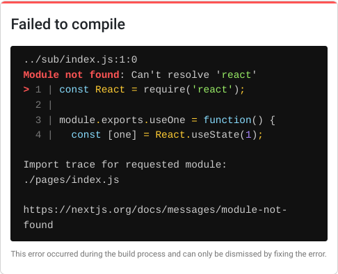

# react-vs-monorepo

The `sub/` packages has React as a peer dep.

Apps `app-cra/` and `app-next/` use it over npm-link. `app-cra/` works, but `app-next/` throws an error.

## Set up

```console
$ cd app-cra
$ npm ci
$ npm link ../sub/
$ npm run start
```

```console
$ cd app-next
$ npm ci
$ npm link ../sub/
$ npm run dev
```

## Next.js



> Failed to compile
> 
> ../sub/index.js:1:0  
> Module not found: Can't resolve 'react'
> 
> ```
> > 1 | const React = require('react');
>   2 | 
>   3 | module.exports.useOne = function() {
>   4 |   const [one] = React.useState(1);
> ```
> 
> Import trace for requested module:
> ./pages/index.js
> 
> https://nextjs.org/docs/messages/module-not-found
